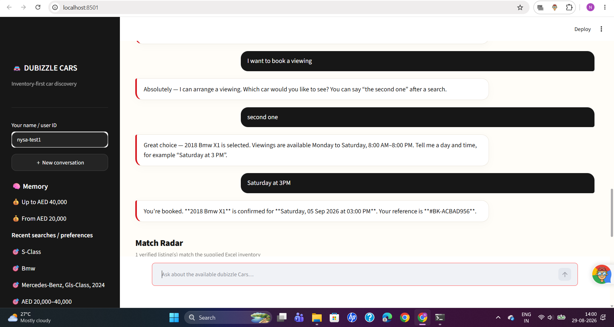
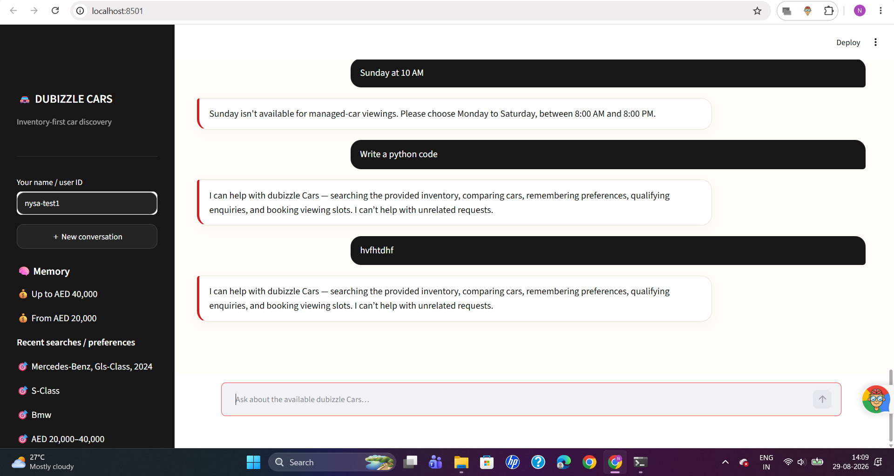

# Dubizzle Cars — Inventory-First AI Assistant

An AI-powered conversational car discovery assistant built with **FastAPI** and **Streamlit**.

The application allows users to search a supplied vehicle inventory using natural language, ask follow-up questions about listings, maintain conversational context, save favourites, remember user preferences across sessions, qualify leads, and simulate viewing bookings.

---

## Features

- Natural-language car search
- Excel-based vehicle inventory as the source of truth
- Multi-turn conversational context
- Follow-up questions about previously displayed vehicles
- Listing-specific vehicle information
- Deterministic extraction of important vehicle attributes
- Price and mileage handling
- Warranty and regional specification information
- Saved favourites
- Persistent user memory
- Preference recall across completely new sessions
- Lead qualification
- Lead confirmation before saving
- CSV lead persistence
- Simulated vehicle viewing bookings
- Booking conflict protection
- Automotive/non-automotive guardrails
- FastAPI backend
- Streamlit conversational interface
- Automated regression tests

---

# Project Architecture

```text
Dubizzle-ai-Nysa/
│
├── backend/
│   ├── __init__.py
│   ├── agent.py
│   ├── config.py
│   ├── db.py
│   ├── inventory.py
│   ├── llm.py
│   ├── main.py
│   ├── parser.py
│   └── schemas.py
│
├── data/
│   ├── cars_dataset.xlsx
│   └── leads.csv
│
├── docs/
│   ├── data_notes.md
│   └── demo_transcript.md
│
├── frontend/
│   ├── api_client.py
│   └── app.py
│
├── screenshots/
│   ├── Booking - Carwise.png
│   ├── Booking.png
│   ├── Find Cars Between AED 20K and AED 40K.png
│   ├── Find Cars under AED 50K.png
│   ├── Front Page.png
│   ├── Guardrails.png
│   ├── Leads saved and Testing.png
│   ├── Long Term Memory-1.png
│   ├── Long Term Memory-2.png
│   ├── Requests Section.png
│   ├── Short Term Memory - Category.png
│   ├── Short Term Memory - Specific car.png
│   ├── Show me SUVS.png
│   └── SUVS Result.png
│
├── tests/
│   ├── test_api.py
│   ├── test_inventory.py
│   └── test_parser.py
│
├── .env.example
├── .gitignore
├── pyproject.toml
├── README.md
└── requirements.txt
```

## Architecture Overview

The application is divided into four main layers:

```text
                    ┌─────────────────────────┐
                    │       Streamlit UI      │
                    │       frontend/app.py   │
                    └────────────┬────────────┘
                                 │
                                 ▼
                    ┌─────────────────────────┐
                    │      FastAPI Backend     │
                    │       backend/main.py    │
                    └────────────┬────────────┘
                                 │
                                 ▼
                    ┌─────────────────────────┐
                    │    Conversational Agent │
                    │      backend/agent.py    │
                    └──────┬─────────┬────────┘
                           │         │
                ┌──────────┘         └──────────┐
                ▼                               ▼
      ┌──────────────────┐             ┌──────────────────┐
      │ Inventory/Search │             │ Memory / Database │
      │ inventory.py     │             │     db.py         │
      │ parser.py        │             │                   │
      └────────┬─────────┘             └──────────────────┘
               │
               ▼
      ┌──────────────────┐
      │ cars_dataset.xlsx│
      │ Source Inventory │
      └──────────────────┘

                    ┌──────────────────┐
                    │      LLM Layer   │
                    │     llm.py       │
                    └──────────────────┘

                    ┌──────────────────┐
                    │ Lead / Booking   │
                    │ Persistence      │
                    │ data/leads.csv   │
                    └──────────────────┘
```

### Backend

The `backend/` package contains the core application logic.

- `main.py` — FastAPI application and API endpoints
- `agent.py` — conversational routing, intent handling, context and agent behaviour
- `inventory.py` — loading and searching the vehicle inventory
- `parser.py` — extraction and normalization of vehicle information
- `llm.py` — LLM integration and natural-language interpretation
- `db.py` — SQLite persistence for memory, preferences, favourites and application state
- `schemas.py` — request and response models
- `config.py` — application configuration and environment variables

### Frontend

The `frontend/` package contains the Streamlit client.

- `app.py` — Streamlit conversational interface
- `api_client.py` — communication between the Streamlit frontend and FastAPI backend

### Data

The `data/` directory contains the supplied vehicle inventory and generated lead records.

- `cars_dataset.xlsx` — vehicle inventory used by the application
- `leads.csv` — persisted lead/enquiry records generated by confirmed user enquiries

Runtime database files are intentionally excluded from Git through `.gitignore`.

### Tests

The `tests/` directory contains automated tests for the main application components.

- `test_api.py` — API and backend behaviour
- `test_inventory.py` — inventory loading and retrieval
- `test_parser.py` — vehicle attribute extraction and parsing

---

# Quick Setup

## 1. Clone the Repository

```powershell
git clone https://github.com/Nysa44/Dubizzle-ai-Nysa.git
cd Dubizzle-ai-Nysa
```

## 2. Create and Activate the Virtual Environment

### Using uv

```powershell
uv venv
.venv\Scripts\Activate.ps1
```

If `uv` is not installed, a standard Python virtual environment can be used:

```powershell
python -m venv .venv
.venv\Scripts\Activate.ps1
```

## 3. Install Dependencies

Using `uv`:

```powershell
uv pip install -r requirements.txt --link-mode=copy
```

Alternatively:

```powershell
python -m pip install -r requirements.txt
```

## 4. Configure the API Key

Create a `.env` file in the project root using `.env.example` as a template.

```text
GEMINI_API_KEY=your_api_key_here
```

Do not commit the `.env` file to GitHub.

The `.gitignore` file already excludes `.env`.

---

# Running the Application

The application uses two processes: a **FastAPI backend** and a **Streamlit frontend**.

## Terminal 1 — Backend

Open a PowerShell terminal in the project directory.

Activate the virtual environment:

```powershell
.venv\Scripts\Activate.ps1
```

Start the FastAPI server:

```powershell
uvicorn backend.main:app --reload
```

The backend will run at:

```text
http://127.0.0.1:8000
```

A successful startup should show:

```text
INFO:     Uvicorn running on http://127.0.0.1:8000
INFO:     Started server process
INFO:     Waiting for application startup.
INFO:     Application startup complete.
```

The API health endpoint can be checked at:

```text
http://127.0.0.1:8000/health
```

---

## Terminal 2 — Frontend

Open a second PowerShell terminal in the project directory.

Activate the virtual environment:

```powershell
.venv\Scripts\Activate.ps1
```

Start Streamlit:

```powershell
streamlit run frontend/app.py
```

The Streamlit interface will normally be available at:

```text
http://localhost:8501
```

Open the displayed URL in a browser.

---

# Design Choices

## Client Setup — Streamlit

I chose **Streamlit instead of a Notebook** because the application is designed around an interactive conversational experience. Streamlit provides a lightweight browser-based chat interface where users can search for vehicles, ask follow-up questions, save favourites, provide contact information, and test memory and booking flows without needing to execute notebook cells manually. It also makes the conversational state and returned inventory results easy to inspect during interaction.

## Agent Framework

The project uses a **lightweight custom agent architecture** rather than introducing a heavy third-party agent framework. The agent is implemented in `backend/agent.py` and coordinates intent recognition, inventory retrieval, conversational context, memory, lead qualification and booking actions. This keeps the system simple and transparent while allowing deterministic application logic to control important actions. The LLM is used for natural-language understanding and response generation rather than being treated as the authoritative source of vehicle data.

## Search and Retrieval

The supplied **Excel vehicle inventory is the source of truth**. The inventory is loaded and normalized through `inventory.py`, while `parser.py` extracts and standardizes vehicle attributes from the available structured and textual listing information.

Search is primarily **structured inventory retrieval** rather than unrestricted LLM generation. User requests are interpreted into useful search constraints such as vehicle type, make, model, price range, mileage and other available attributes. Matching vehicles are then retrieved from the supplied dataset. This approach keeps factual vehicle responses grounded in the available inventory and reduces hallucination.

## Memory Storage

**SQLite** is used for persistent memory because it is lightweight, local, easy to inspect and appropriate for the scope of the application. Short-term conversational state is maintained for the active session so that follow-up references such as "the second one" or "that car" can be resolved against the current inventory results.

Long-term user information is stored separately so that preferences and favourites can be retrieved even when a completely new conversation/session is started. This allows the assistant to remember information such as a user's preferred vehicle category or budget across sessions.

---

# Implementation and Design Decisions

The system separates conversational interpretation from deterministic application actions. Search requests are converted into structured inventory queries, while follow-up questions can operate on the currently active result set or a selected listing. Important vehicle information is resolved from the inventory and listing data rather than relying solely on generated model knowledge. This design provides a clear boundary between language understanding and factual inventory retrieval.

The application also separates temporary conversation state from persistent user memory. Favourites, preferences and lead information can therefore persist independently of a specific chat session. Lead creation requires user information and confirmation before the enquiry is persisted, while viewing bookings include validation and conflict protection. These decisions make the prototype more predictable and easier to test.

---

# Features Outside the Scope

The current implementation focuses on conversational vehicle discovery and related user flows. A production version could additionally include real user authentication, role-based access control, a production database, dealership CRM integration, live inventory synchronization, real appointment availability, payment processing, production-scale vector retrieval, analytics dashboards, advanced multilingual support and cloud deployment infrastructure.

Real-world integrations were intentionally kept outside the current scope so that the core assistant could focus on reliable inventory-grounded search, conversational context, persistent memory, lead qualification and booking behaviour.

---

# Demonstrations

## 1. Multi-Turn Inventory Exploration

The assistant maintains the active inventory result set across multiple turns. After searching for vehicles, the user can ask follow-up questions about the returned vehicles without repeating the original search.

### Screenshots


---

## 2. Long-Term Memory Across a New Session

The application stores user preferences and favourites in persistent storage.

A user can provide a preference during one conversation and then start a completely new conversation. The assistant can retrieve the stored information and use it when responding to the user.


### Screenshots


---

## 3. Lead Qualification and Persistence

Users can provide their contact information when they are interested in a vehicle.

The application collects the required information, presents the enquiry for confirmation, and persists confirmed enquiries into `data/leads.csv`.


### Screenshot


---

## 4. Viewing Booking

The application supports a simulated vehicle viewing flow. Users can select a vehicle, provide a preferred viewing time and confirm the booking.

The booking flow includes validation to prevent conflicting bookings.

### Screenshots




---

## 5. Guardrails

The assistant includes guardrails to keep the conversational experience focused on vehicle discovery and supported application actions.

### Screenshot



---

# Testing

The project includes automated regression tests covering inventory loading, vehicle parsing, API behaviour and core application functionality.

## Run the Full Test Suite

Open a PowerShell terminal in the project directory.

Activate the environment:

```powershell
.venv\Scripts\Activate.ps1
```

Run:

```powershell
python -m pytest -q
```

Expected result:

```text
.......................................... [100%]

42 passed, 1 warning
```

The test suite currently completes successfully with **42 passing tests**.

A Starlette/httpx deprecation warning may appear depending on the installed dependency versions. This warning does not indicate a failing test.

---

# Verifying Saved Leads

After completing a confirmed lead flow, the generated lead records can be inspected from PowerShell:

```powershell
Import-Csv .\data\leads.csv | Format-Table -AutoSize
```

Example:

```text
lead_id        created_at           user_id   session_id
-------        ----------           -------   ----------
LEAD-35CC864D  2026-08-29T15:34:33  nysaa     8040023a...
LEAD-DE6AF897  2026-08-29T15:35:58  nysaa     8040023a...
```

The records demonstrate that confirmed enquiries are persisted with lead identifiers, timestamps, user/session information and qualification data.

---

# Example Backend Logs

A successful backend startup and frontend interaction can produce logs similar to:

```text
INFO:     Uvicorn running on http://127.0.0.1:8000
INFO:     Started reloader process
INFO:     Started server process
INFO:     Waiting for application startup.
INFO:     Application startup complete.

INFO:     127.0.0.1:61677 - "GET /users/demo_dubizzle/memory HTTP/1.1" 200 OK
INFO:     127.0.0.1:61678 - "GET /health HTTP/1.1" 200 OK
INFO:     127.0.0.1:61679 - "GET /users/nysaa/memory HTTP/1.1" 200 OK
INFO:     127.0.0.1:61680 - "GET /health HTTP/1.1" 200 OK
INFO:     127.0.0.1:61681 - "GET /users/nysaa/memory HTTP/1.1" 200 OK
```

---

# Data Flow

```text
User
 │
 ▼
Streamlit Interface
 │
 ▼
FastAPI API
 │
 ▼
Conversational Agent
 │
 ├──────────────► LLM / Natural Language Interpretation
 │
 ├──────────────► Inventory Retrieval
 │                    │
 │                    ▼
 │              cars_dataset.xlsx
 │
 ├──────────────► Short-Term Session Context
 │
 ├──────────────► Long-Term SQLite Memory
 │
 ├──────────────► Favourites
 │
 ├──────────────► Lead Qualification
 │                    │
 │                    ▼
 │                leads.csv
 │
 └──────────────► Viewing Booking
```

---

# Technology Stack

| Component | Technology |
|---|---|
| Frontend | Streamlit |
| Backend | FastAPI |
| Server | Uvicorn |
| Language | Python |
| LLM | Google Gemini |
| Inventory Source | Excel (`.xlsx`) |
| Inventory Processing | Pandas / Python |
| Persistent Memory | SQLite |
| Lead Storage | CSV |
| Testing | Pytest |
| Environment | Python virtual environment / uv |

---

# Repository Structure

The repository is intentionally organized so that the main responsibilities are separated:

```text
backend/       → API, agent, inventory, parsing, memory and LLM logic
frontend/      → Streamlit interface and API client
data/          → Vehicle inventory and generated lead data
docs/          → Supporting documentation and demo information
screenshots/   → Demonstration screenshots
tests/         → Automated tests
```

---

# Running Summary

For a fresh setup, the complete workflow is:

### Terminal 1

```powershell
git clone https://github.com/Nysa44/Dubizzle-ai-Nysa.git
cd Dubizzle-ai-Nysa
uv venv
.venv\Scripts\Activate.ps1
uv pip install -r requirements.txt --link-mode=copy
uvicorn backend.main:app --reload
```

### Terminal 2

```powershell
cd Dubizzle-ai-Nysa
.venv\Scripts\Activate.ps1
streamlit run frontend/app.py
```

### Terminal 3 — Tests

```powershell
cd Dubizzle-ai-Nysa
.venv\Scripts\Activate.ps1
python -m pytest -q
```

The expected test result is:

```text
42 passed
```

---

# Notes

- The Excel inventory is treated as the authoritative vehicle data source.
- Runtime databases and generated lead data are excluded from version control where appropriate.
- API credentials should be stored in `.env` and never committed.
- The viewing and lead flows are simulated locally and do not connect to a real dealership CRM or appointment system.
